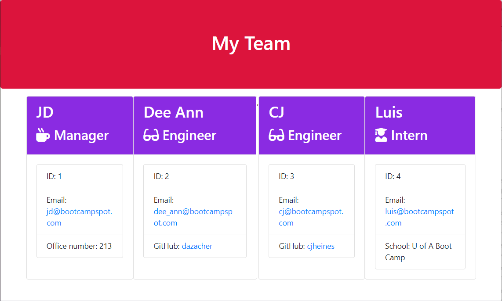

#### Table of Contents

* [Author](#author)
* [Title](#title)
* [Description](#description)
* [Installation](#installation)
* [Usage](#usage)
* [License](#license)
* [Contributing](#contributing)
* [Tests](#tests)
* Questions
    * [Picture](#picture) Due you want your profile picture?
    * [Email](#email) Do you want your GitHub email?
    
### Author

The author of this project is: Dee Ann Scanniello

### Title

OOP-Programming

### Description

This app asks the user to select between a Create Manager, Create Engineer, Create Intern, or Create Team options. The user is then asked various questions about each employee to enter in oder to create an html output of a team roster. Validation was used for all the inputs. Challenges included how to get the data for each employee into one inquirer response. This was achieved by creating separate functions for each employee, and then pushing that employee data to an employee object array that was used to render the html. A loop was created by calling the userPrompt function at the end of each employee function.  The loop was ended when the Create Team option was selected. This option called the render html file function and then wrote the data to an html file. Some challenges were found in the validation part of the assignment, which was optional, but a little trial and error fixed those right up.

### Installation

Install the project by doing the following: Enter npm install in the Terminal window.

### Usage

Use the app by doing the following: The Author has chosen not to describe how to use their app.

### License

License: APACHE 2.0

### Contributing

Contributing: There is no contributing data to show.

### Tests

Tests: The Author has no tests to show.

### Picture

### Email

dazacher2000@yahoo.com

### Badge

